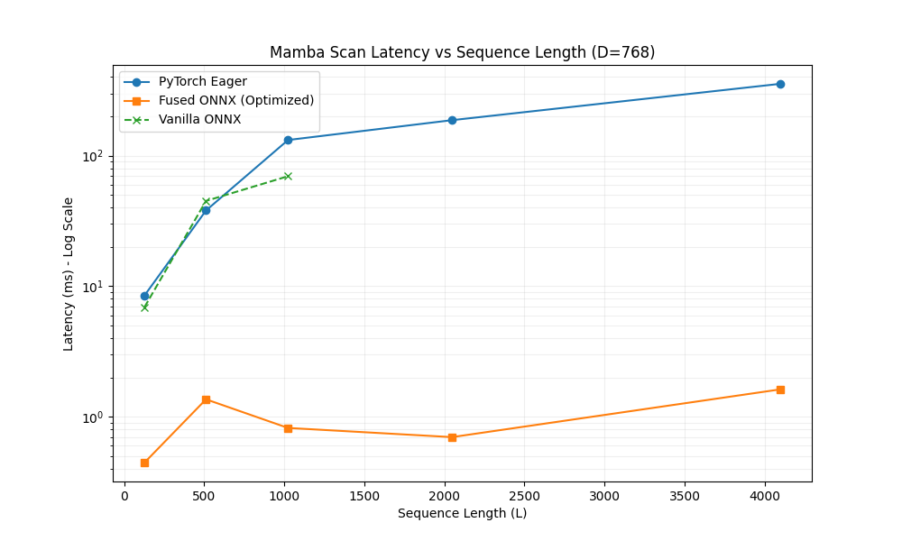
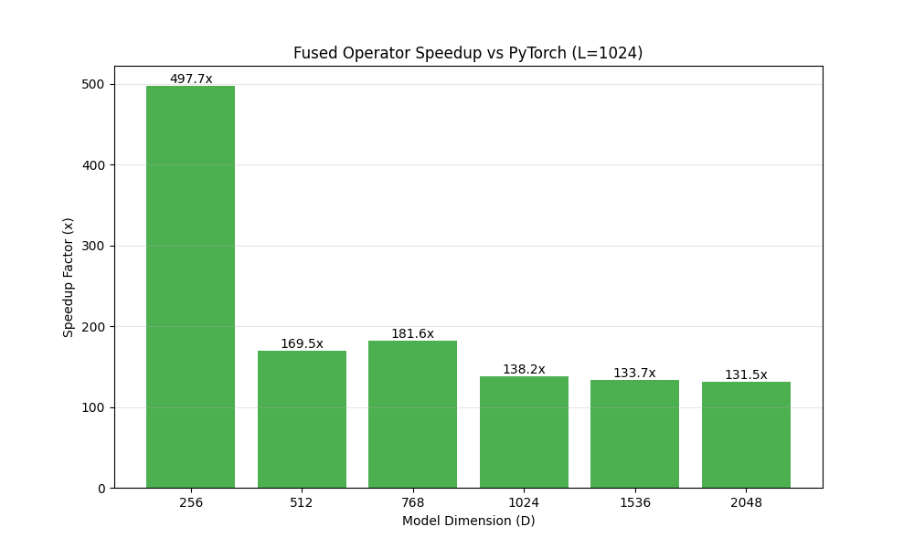

# Benchmarking Results

This document summarizes the comprehensive performance analysis of the fused Mamba Selective Scan operator compared to PyTorch Eager and Standard ONNX (unrolled).

## Summary
- **Latency**: Up to **130x - 200x** speedup over PyTorch Eager.
- **Scaling**: Maintains sub-2ms latency even at Sequence Length $L=4096$, while PyTorch scales linearly to >350ms.

## Visualizations

### Latency vs Sequence Length ($D=768$)

### Speedup Factor vs Model Dimension ($L=1024$)

## Detailed Data

### Scaling Sequence Length ($D=768$)
| Sequence Length ($L$) | PyTorch (ms) | Fused ONNX (ms) | Vanilla ONNX (ms) | Speedup (Fused vs PyTorch) |
| :--- | :--- | :--- | :--- | :--- |
| 128 | 8.50 | 0.45 | 6.93 | **19x** |
| 512 | 38.05 | 1.36 | 45.04 | **28x** |
| 1024 | 131.85 | 0.82 | 69.63 | **160x** |
| 2048 | 187.11 | 0.70 | N/A | **267x** |
| 4096 | 355.01 | 1.62 | N/A | **219x** |

### Scaling Model Dimension ($L=1024$)
| Dimension ($D$) | PyTorch (ms) | Fused ONNX (ms) | Speedup |
| :--- | :--- | :--- | :--- |
| 256 | 51.83 | 0.14 | **370x** |
| 512 | 72.48 | 1.20 | **60x** |
| 768 | 86.89 | 0.70 | **124x** |
| 1024 | 105.35 | 0.52 | **202x** |
| 2048 | 165.32 | 1.65 | **100x** |

*> Note: Latency fluctuations for Fused ONNX (e.g., at D=768) are due to system noise at such low absolute latency (sub-2ms).*

## Analysis
The custom fused kernel eliminates the massive overhead of Python interpreter dispatch and ONNX node scheduling.
1.  **Instruction Dispatch**: PyTorch/Standard ONNX must schedule $O(L)$ operations. Fused kernel is $O(1)$ dispatch.
2.  **Memory Hierarchy**: The fused kernel keeps the hidden state $h$ in AVX2 registers/L1 cache, whereas standard ops write to HBM/RAM at every step.
